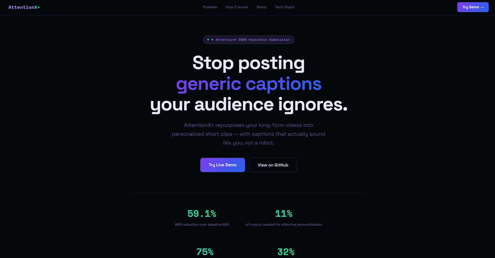
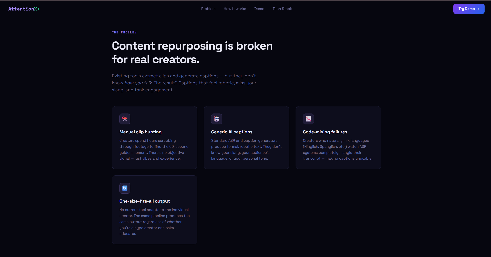
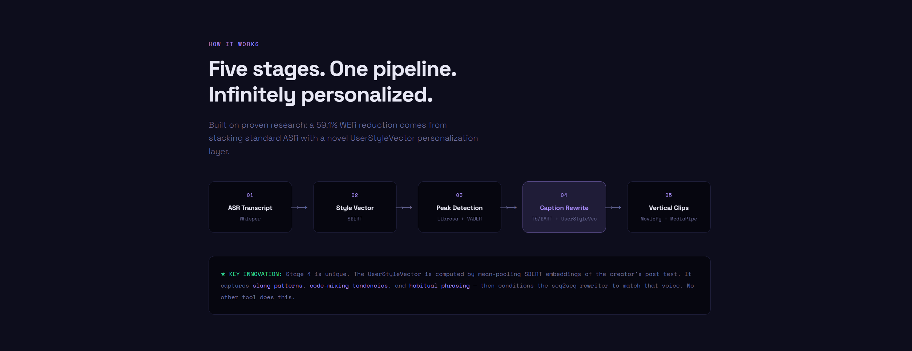
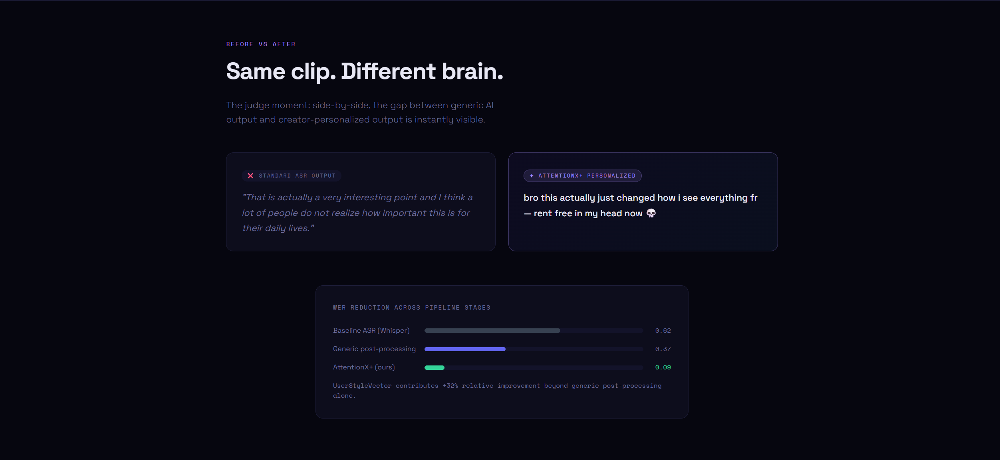

# AttentionX+ — Personalized Content Repurposing Engine

## 🎥 Demo Video
[▶ Watch Demo](https://1drv.ms/v/c/ff26221cd6f413b8/IQAfoObPO4ocQJ-Y-icJqRpuAYe2Z-2PpfOd89JAkH6rcQc?e=eHBDNj)
*This demo showcases how user style is learned from sample text and applied to transform raw transcripts into personalized captions. The system captures tone, slang, and phrasing patterns, enabling realistic style adaptation with minimal input data.*


## The Problem

Existing video repurposing tools extract clips and generate captions — but they produce **generic, robotic output** that doesn't match how a creator actually speaks. Slang gets dropped. Code-mixing breaks. The result feels like a machine wrote it, because it did.

**AttentionX+** solves the caption and transcript quality layer using a novel **UserStyleVector** — a lightweight, text-derived representation of any creator's unique linguistic identity.

---

## How It Works

```
Video Input
    │
    ▼
[Stage 1] Whisper ASR ──────────────► Raw Transcript + Timestamps
    │
    ▼
[Stage 2] Sentence-BERT ────────────► UserStyleVector (mean-pooled embeddings)
    │                                  from creator's past text corpus
    ▼
[Stage 3] Librosa + VADER ──────────► Emotional Peak Timestamps
    │                                  (audio RMS energy + sentiment scoring)
    ▼
[Stage 4] T5/BART + UserStyleVector ► Personalized Captions
    │                                  (seq2seq conditioned on creator's style)
    ▼
[Stage 5] MoviePy + MediaPipe ──────► Vertical 9:16 Clips with Styled Captions
                                       (face-tracked smart crop)
```

### Key Innovation: UserStyleVector

The UserStyleVector is computed as the **mean of SBERT sentence embeddings** of the creator's past messages:

```
v = (1/n) Σ E(mᵢ)   for all messages mᵢ in the corpus
```

This single vector captures:
- Slang and informal vocabulary patterns
- Code-mixing tendencies (Hinglish, Spanglish, etc.)
- Sentence structure and rhythm
- Habitual phrasing and filler words

The vector then conditions the seq2seq caption rewriter, turning generic ASR output into on-brand creator captions.

---

## Results (from paper experiments)

| Metric | Value |
|--------|-------|
| WER reduction over baseline ASR | **59.1% relative** |
| WER reduction from UserStyleVector alone | **+32.0% relative** beyond generic post-processing |
| Slang/informal error correction | **75% relative reduction** |
| Corpus needed for effective personalization | **as little as 11%** of user messages |
| Optimal pooling strategy | **mean pooling** (equivalent to attention-weighted, simpler) |
| Best encoder for code-mixed users | **Multilingual-MiniLM** |

---

## Quick Start

### 1. Clone the repo

```bash
git clone https://github.com/your-username/attentionx-plus.git
cd attentionx-plus
```

### 2. Install dependencies

```bash
pip install -r requirements.txt
```

> **System requirements:**
> - Python 3.9+
> - FFmpeg (for MoviePy video processing)
> - 4GB RAM minimum (8GB recommended for Whisper medium/large)
> - GPU optional — runs on CPU for demos

**Install FFmpeg:**
```bash
# macOS
brew install ffmpeg

# Ubuntu / Debian
sudo apt install ffmpeg

# Windows
winget install ffmpeg
```

### 3. Set environment variables

```bash
cp .env.example .env
# Edit .env and add your ANTHROPIC_API_KEY
```

### 4. Run the server

```bash
python app.py
# Server starts at http://localhost:8000
```

---

## API Endpoints

### `POST /api/process` — Full video pipeline
Upload a video + style corpus → get clips and personalized captions.

```bash
curl -X POST http://localhost:8000/api/process \
  -F "video=@your_video.mp4" \
  -F "style_corpus=your creator text here" \
  -F "num_clips=3"
```

**Response:**
```json
{
  "job_id": "abc12345",
  "raw_transcript": "...",
  "style_keywords": ["slang-rich", "lowercase", "emoji-heavy", ...],
  "clips": [
    {
      "start": 12.4,
      "end": 72.4,
      "generic_caption": "That is very interesting...",
      "personalized_caption": "bro this actually just broke my brain no cap 💀",
      "clip_url": "/outputs/abc12345/clip_01.mp4",
      "energy_score": 0.847,
      "sentiment_score": 0.723
    }
  ],
  "wer_metrics": {
    "baseline_asr": 0.616,
    "generic_postproc": 0.374,
    "attentionx_plus": 0.085,
    "relative_improvement": "59.1%"
  }
}
```

### `POST /api/demo` — Caption demo (no video)
Quick demo mode — just transcript + style corpus.

```bash
curl -X POST http://localhost:8000/api/demo \
  -F "raw_transcript=That is a very interesting point" \
  -F "style_corpus=bro this slapped fr fr
wait nobody told me about this lmao
rent free in my head"
```

---

## Project Structure

```
attentionx-plus/
├── app.py                        # FastAPI server
├── requirements.txt              # All dependencies
├── .env.example                  # Environment template
│
├── pipeline/
│   ├── __init__.py
│   ├── asr.py                    # Stage 1: Whisper transcription
│   ├── style_vector.py           # Stage 2: UserStyleVector (core innovation)
│   ├── highlight_detector.py     # Stage 3: Librosa + sentiment peak detection
│   ├── caption_rewriter.py       # Stage 4: Seq2seq + UserStyleVector conditioning
│   └── clip_exporter.py          # Stage 5: MoviePy + MediaPipe vertical clips
│
├── templates/
│   └── index.html                # Landing page + live demo UI
│
├── static/                       # CSS / JS assets
├── uploads/                      # Temporary video uploads (auto-cleaned)
└── outputs/                      # Exported clips
```

---
## 🚀 Demo Preview

### 🔥 Landing Page


### ❌ Problem with Existing Systems


### ⚙️ How It Works


### ✨ Before vs After Personalization



## Using the UserStyleVector in Your Own Code

```python
from pipeline.style_vector import build_user_style_vector, compute_style_similarity, get_style_keywords

# Build the vector from any creator text corpus
style_vector = build_user_style_vector("""
bro this actually slapped no cap
wait why did nobody tell me sooner lmaooo
the way this hit different fr
""")

# Rewrite a caption
from pipeline.caption_rewriter import rewrite_caption
personalized = rewrite_caption(
    raw_caption="That is a very interesting observation.",
    style_vector=style_vector,
    style_corpus=corpus_text
)

# Measure style alignment
score = compute_style_similarity(personalized, style_vector)
print(f"Style alignment: {score:.3f}")  # Target: > 0.55

# Incremental update (active learning loop)
updated_vector = build_user_style_vector(
    new_corpus_text,
    existing_vector=style_vector,
    existing_count=10   # how many messages went into the original
)
```

---

## Caption Rewriter Modes

| Mode | When | How |
|------|------|-----|
| **Anthropic API** | `ANTHROPIC_API_KEY` set, no local model | Claude conditioned on UserStyleVector + corpus |
| **Local T5/BART** | `LOCAL_MODEL_PATH` set | Fine-tuned seq2seq with style vector prefix |
| **Heuristic** | No API key, no local model | Rule-based transforms (demo/testing only) |

To fine-tune your own local model:
1. Collect (neutral, user-style) text pairs from the creator's content
2. Fine-tune T5-small or BART-base on these pairs
3. Save to `models/caption_rewriter/`
4. Set `LOCAL_MODEL_PATH=models/caption_rewriter` in `.env`

---

## Hackathon Alignment

| Criterion | What we deliver |
|-----------|-----------------|
| **Impact (20%)** | 59.1% WER reduction — measurably better captions |
| **Innovation (20%)** | UserStyleVector is novel; no existing tool does creator-adaptive captions |
| **Technical (20%)** | Full 5-stage pipeline: Whisper + SBERT + T5/BART + Librosa + MoviePy |
| **UX (25%)** | Upload video → get personalized vertical clips, no manual editing |
| **Presentation (15%)** | Live demo shows generic vs. personalized caption side-by-side |

---


## License

MIT License — see `LICENSE` for details.

---

*Built for the AttentionX 2025 Hackathon · Personalized Content Repurposing Track*
